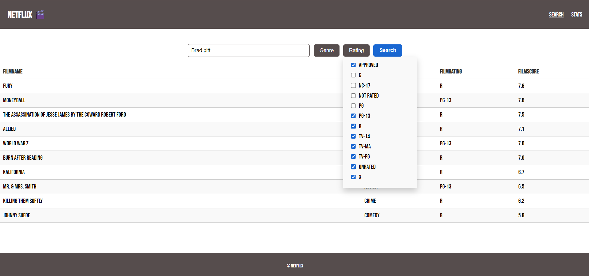
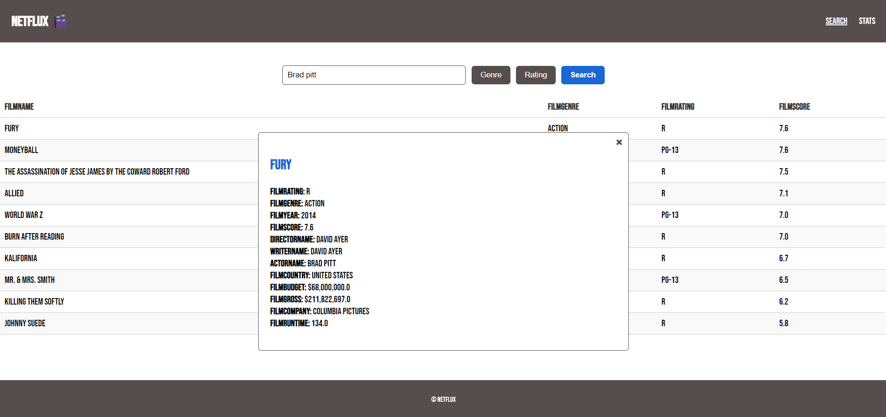
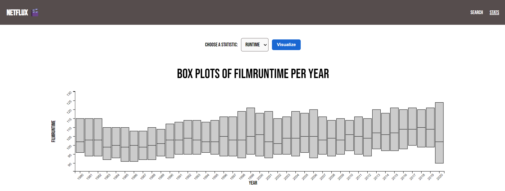
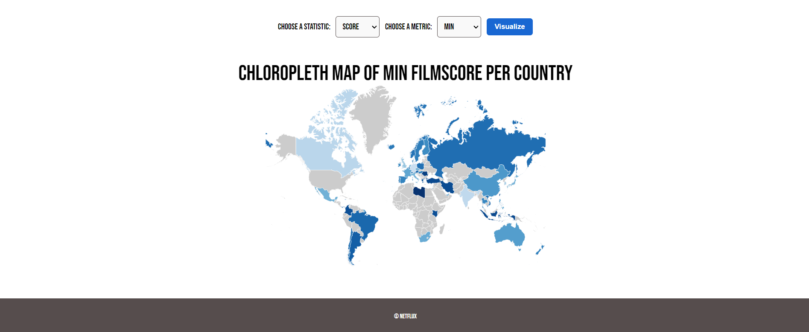

# Netflux

## Author
- Marin Chevolleau | [@marin-chevolleau](https://github.com/marin-chevolleau)

## Dependencies

### Java 
- ♨️ Java 17

## Structure

### Files

```bash
├── 📁 data
│   ├── 🐢 movies schema.ttl
│   ├── 📊 movies.csv
│   └── 🐢 movies.ttl
├── 📁 illustrations
│   ├── 🖼️ search-page-details.png
│   ├── 🖼️ search-page-list.png
│   ├── 🖼️ stats-page-by-country.png
│   ├── 🖼️ stats-page-by-year.png
│   └── 🖼️ turtle_visualization.svg
├── 📁 web
│   ├── 📁 css
│   │   ├── 🎨 global.css
│   │   ├── 🎨 index.css
│   │   └── 🎨 stats.css
│   ├── 📁 js
│   │   ├── 🛠️ countries.js
│   │   ├── 🛠️ d3.v7.min.js
│   │   ├── 🛠️ index.js
│   │   └── 🛠️ stats.js
│   ├── 🌐 index.html
│   └── 🌐 stats.html
└── 📜 README.md
```

### Execution

1. Clone repository `git clone https://github.com/marin-chevolleau/netflux.git`
2. Run the command `./fuseki-server --port 3030` within the folder `apache-jena-fuseki-X.X.X` (`X` being a number) to start the [Fuseki](https://downloads.apache.org/jena/binaries/apache-jena-fuseki-5.0.0.zip) server
3. Open a web browser and access the URL `http://127.0.0.1:3030/#/`
4. Go to tab `Manage Datasets` (`http://127.0.0.1:3030/#/manage`) and create a dataset named movies `movies`
5. Click on `Add Data` (`http://127.0.0.1:3030/#/dataset/movies/upload`) to add files `movies schema.ttl` and `movies.ttl` to the `movies` data set 
6. *(**OPTIONAL**) Go to tab `Query` (`http://127.0.0.1:3030/#/dataset/movies/query`) to execute SPARQL queries*.
7. Open the file ```web/index.html``` in a web browser to access the web application.

### Turtle visualization

Here is a visualization of an extract from the Turtle data file.


## Screen shots

### Stats page

##### Movies list



##### Movies details



#### 6.2. Stats page

##### 6.2.1. Stats per year



##### 6.2.2. Stats per country



## TODO

Some countries are misrepresented due to different syntax in the raw data and in the geojson file. Matching their names and setting up a data collection process would solve this problem.
